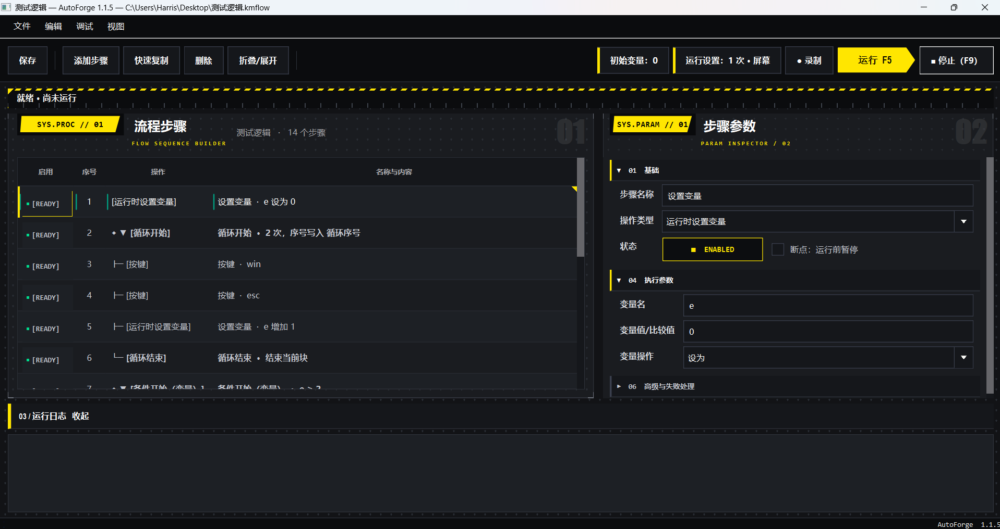

# AutoForge

AutoForge 是一个面向 Windows 桌面、远程桌面和业务系统的本地视觉自动化工具。

它通过可视化流程编辑器，把鼠标、键盘、文字输入、图片识别和 OCR 判断组合成可重复执行的自动化流程。流程和图片素材保存在单个 `.kmflow` 文件中，不依赖 Excel 或在线服务。

当前稳定版：**1.1.5**

## 界面预览




## 核心功能

- 可视化添加、编辑、复制、删除和拖动排序步骤
- 鼠标点击、拖动、滚轮、键盘、组合键、文字输入和等待
- OpenCV 图片匹配，支持识别区域、置信度和多缩放比例
- RapidOCR 中文/英文文字查找、等待和条件判断
- 屏幕坐标与目标窗口相对坐标两种模式，可跟随窗口移动和缩放
- 条件分支、否则分支、循环块和嵌套流程控制
- 条件/循环块整体折叠、复制、删除、移动和排序
- 可复用子流程，支持变量共享或独立作用域
- 流程变量、运行次数、失败重试、超时和失败后停止/继续
- PyAutoGUI 兼容输入后端与 Windows 原生 SendInput 后端
- 操作录制：录制鼠标、键盘、文字和停顿，并生成可编辑步骤
- 图片素材截图、裁剪、替换和单次识别测试
- 断点、暂停、继续、单步执行、局部运行和安全测试
- 运行日志、SQLite 运行历史和失败现场截图
- 全局 `F9` 紧急停止，录制使用 `F8` 结束

## 安装

建议使用 64 位 Python 3.10、3.11 或 3.12，并在 Windows 上运行。

### 快速安装

双击项目目录中的：

```text
安装依赖.bat
```

脚本会在项目目录创建独立的 `.venv`，并安装 OCR 组件。

### 手动安装

```powershell
python -m venv .venv
.venv\Scripts\python.exe -m pip install -r requirements.txt
```

如果需要图片文字识别，再安装 OCR 依赖：

```powershell
.venv\Scripts\python.exe -m pip install -r requirements-ocr.txt
```

## 启动

双击：

```text
启动.bat
```

也可以在终端运行：

```powershell
.venv\Scripts\python.exe main.py
```

## 基本使用流程

1. 点击“添加步骤”，选择鼠标、键盘、图片识别、OCR 或流程控制步骤。
2. 在右侧参数面板填写目标图片、坐标、文字、超时和重试设置。
3. 需要识别图片时，可直接截图、裁剪或执行一次识别测试。
4. 使用“运行设置”选择运行次数、间隔、输入后端和目标窗口。
5. 点击运行按钮或按 `F5` 执行流程。
6. 使用 `F6` 设置断点，`F7` 继续，`F10` 单步执行，`F9` 紧急停止。
7. 使用 `Ctrl+S` 保存为 `.kmflow` 流程包。

## 流程文件格式

`.kmflow` 本质上是一个 ZIP 容器，结构类似：

```text
workflow.json
assets/
  capture_*.png
```

导入子流程时，AutoForge 会把子流程作为独立副本打包到当前流程中，移动原始文件不会影响已导入的流程。


## 项目结构

```text
AutoForge/
├─ main.py                 # 程序入口
├─ keymouse/               # GUI、流程模型、执行引擎和录制模块
├─ requirements.txt        # 基础依赖
├─ requirements-ocr.txt    # OCR 依赖
├─ 安装依赖.bat            # 创建环境并安装依赖
├─ 启动.bat                # 启动程序
├─ docs/                   # 界面预览和说明图片
├─ CHANGELOG.md            # 版本更新记录
├─ SECURITY.md             # 安全问题和发布前检查
├─ LICENSE                 # Apache-2.0 许可证
└─ data/                   # 本地运行历史和失败截图
```

## 使用注意

- 运行自动化时，目标窗口应保持可见、解锁并处于前台。
- 远程桌面、Windows 显示缩放和浏览器缩放变化可能影响固定坐标，优先使用图片识别或目标窗口相对坐标。
- 使用 SendInput 时，AutoForge 与目标程序需要保持相同的管理员权限级别。

## 后续更新想法

- 功能不想弄得太复杂了,感觉太复杂的流程,不如直接用市场上成熟的rpa软件
- 加入api接口,可接入ai,通过ai分析录制动作,优化出具体流程,没想好如何弄先放着
- 随缘更新

## 许可证

本项目采用 [Apache License 2.0](LICENSE)。第三方依赖仍受其各自许可证约束。
